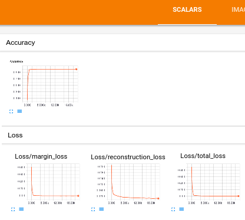

# Capsule Network (Tensorflow) + adversarial attack
Capsule Network implementation in Tensorflow based on Geoffrey Hinton's paper [Dynamic Routing Between Capsules](https://arxiv.org/abs/1710.09829).

## Contents:
* [1. Introduction](https://github.com/amobiny/Capsule_Network_Tensorflow#1-introduction)
  * [1.1. Learning about CapsNet](https://github.com/amobiny/Capsule_Network_Tensorflow#11-learning-about-capsnet)
  * [1.2. Code Features](https://github.com/amobiny/Capsule_Network_Tensorflow#12-code-features) 
  * [1.3. Dependencies](https://github.com/amobiny/Capsule_Network_Tensorflow#13-dependencies)
* [2. How to run the code](https://github.com/amobiny/Capsule_Network_Tensorflow#2-how-to-run-the-code)
  * [2.1. Train](https://github.com/amobiny/Capsule_Network_Tensorflow#21-train)
  * [2.2. Test](https://github.com/amobiny/Capsule_Network_Tensorflow#22-test)
  * [2.3. Visualize](https://github.com/amobiny/Capsule_Network_Tensorflow#23-visualize)
  * [2.4. Adversarial attack](https://github.com/amobiny/Capsule_Network_Tensorflow#24-adversarial-attack)
* [3. Results](https://github.com/amobiny/Capsule_Network_Tensorflow#3-results)
  * [3.1. Classification](https://github.com/amobiny/Capsule_Network_Tensorflow#31-classification)
  * [3.2. Reconstruction](https://github.com/amobiny/Capsule_Network_Tensorflow#32-reconstruction)
  * [3.3. Adversary attack](https://github.com/amobiny/Capsule_Network_Tensorflow#33-adversary-attack)


*Fig1. Capsule Network architecture from Hinton's paper*


## 1. Introduction
### 1.1. Learning about CapsNet:
> 
I started learning about CapsNet by reading the paper and watch Hinton's talks (like [This one](https://www.youtube.com/watch?v=rTawFwUvnLE&feature=youtu.be)). While they are fascinating, they give very limited information (most likely due to papers page limitation and talk's time limitation). So to get the detailed picture, I watched many videos and read many blogs. My suggestions to fully master the Capsule Network's theory are the following sources (of course other than Hinton's paper):
> 1. Max Pechyonkin's [blog series](https://medium.com/ai%C2%B3-theory-practice-business/understanding-hintons-capsule-networks-part-i-intuition-b4b559d1159b)
> 2. Aurélien Géron's videos on [Capsule Networks – Tutorial](https://www.youtube.com/watch?v=pPN8d0E3900&t=297s) and [How to implement CapsNets using TensorFlow](https://www.youtube.com/watch?v=2Kawrd5szHE)

### 1.2. Code Features:

This code is partly inspired from Liao's implementation [CapsNet-Tensorflow](https://github.com/naturomics/CapsNet-Tensorflow) with changes applied to add some features as well as making the code more efficient.

The main changes include:
* The Capslayer class is removed as I found it to be unnecessary at this level. This makes the whole code shorter and structured.
* __Hard-coded values__ (such as the number of capsules, hidden units, etc.) are all extracted and are accessible through ``config.py`` file. Therefore, making changes in the network structure is much more convenient.
* __Summary__ writers are modified. Liao's code writes the loss and accuracy only for the final batch after a certain desired steps. Here, it's modified to write the average loss and accuracy values which is what we should exactly look at.
* __Masking__ procedure is modified. This code is much easier to understand how the masking changes between train and test. 
* __Visualize__ mode is added which helps to plot the reconstructed sample images and visualize the network prediction performance. 
* __Saving__  and __Loading__ of the trained models are improved.
* __Data sets__ (MNIST and fashion-MNIST) get downloaded, automatically. 
* This code __Displays__ the real time results in the terminal (or command line).

All in all, the main features of the code are:
> 1. The current version supports [MNIST](http://yann.lecun.com/exdb/mnist/) and [Fashion-MNIST](https://github.com/zalandoresearch/fashion-mnist) datasets. 
> 2. Run the code in **Train**, **Test**, and **Visualize** modes (explained at the bottom). 
> 3. The best validation and test accuracy for MNIST , and Fashion-MNIST  are as follows (see details in the [Results](https://github.com/amobiny/Capsule_Network_Tensorflow#3-results)  section):

 Data set | Validation accuracy | Validation Loss | Test Accuracy | Test Loss |
:-----|:----:|:----:|:----|:----|
MNIST | % 99.54 | 0.0095 | % 99.49 | 0.0095 |
Fahion-MNIST | % 91.09 | 0.076 | % 90.71 | 0.079 |

### 1.3. Dependencies
- Python (2.7 preferably; also works fine with python 3)
- NumPy
- [Tensorflow](https://github.com/tensorflow/tensorflow)>=1.3
- Matplotlib (for saving images)

## 2. How to run the code
The code downloads the MNIST and Fashion-mnist datasets automatically if needed. MNIST is set as the default dataset.

__Note:__ The default parameters of batch size is 128, and epoch 50. You may need to modify the ```config.py``` file or use command line parameters to suit your case, e.g. set batch size to 64: ```python main.py --batch_size=64```

### 2.1 Train:
Training the model displays and saves the training results (accuracy and loss) in a .csv file after your desired number of steps (100 steps by default) and validation results after each epoch. 
- For training on MNIST data: ```python main.py ```
- Loading the model and continue training: ```python main.py --restore_training=True```
- For training on Fashion-MNIST data: ```python main.py --dataset=fashion-mnist```
- For training with a different batch size: ```python main.py --batch_size=100```
### 2.2 Test:
- For training on MNIST data: ```python main.py --mode=test```
- For training on Fashion-MNIST data: ```python main.py --dataset=fashion-mnist --mode=test```

### 2.3. Visualize
This mode is for running the trained model on a number of samples, get the predictions, and visualize (on 5 samples by default) the original and reconstructed images (also saved automatically in the __/results/__ folder).

- For MNIST data on 10 images: ```python main.py --mode=visualize --n_samples=10```
- For Fashion-MNIST data: ```python main.py --mode=visualize ```

### 2.4. Adversarial attack
This mode is to check the vulnerability of the capsule network to adversarial examples; inputs that have been slightly changed by an attacker so as to trick a neural net classifier into making the wrong classification.
Currently, only the untargeted BFGS method and it's iterative counterpart (commonly called Basic Iteration Method or BIM) are implemented. To run it on the trained model, use:

- FGSM mode: ```python main.py --mode=adv_attack```
- BIM mode: ```python main.py --mode=adv_attack --max_iter=3```

## 3. Results

### 3.1. Classification
Training, validation and test results get saved separately for each dataset in .csv formats. By default, they get saved in the __/results/__ directory.

To view the results and summaries in **Tensorboard**,  open the terminal in the main folder and type: ```tensorboard --logdir=results/mnist``` for MNIST or ```tensorboard --logdir=results/fashion-mnist```, then open the generated link in your browser. It plots the average accuracy and total loss over training batches (over 100 batches by default), as well as the marginal and reconstruction loss separately. They are accessible through *scalars* tab on the top menu.



*Fig2. Accuracy and loss curves in Tensorboard*

### 3.2. Reconstruction
You can also monitor the sample images and their reconstructed counterparts in realtime from the *images* tab.


*Fig3. Sample original and recunstructed images in Tensorboard*

After training, you can also run the code in **visualize** mode and get some of the results on sampled images saved in .png format. Example results for both MNIST and Fashion-MNIST data are as follows:


*Fig4. Original and reconstructed images for MNIST and Fashion-MNIST data generated in **visualize** mode*

### 3.3. Adversary attack
To do soon (already added to the code)


